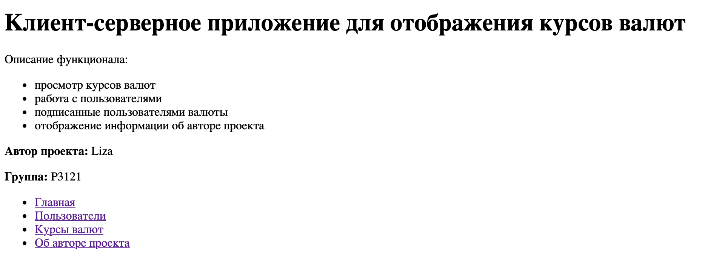
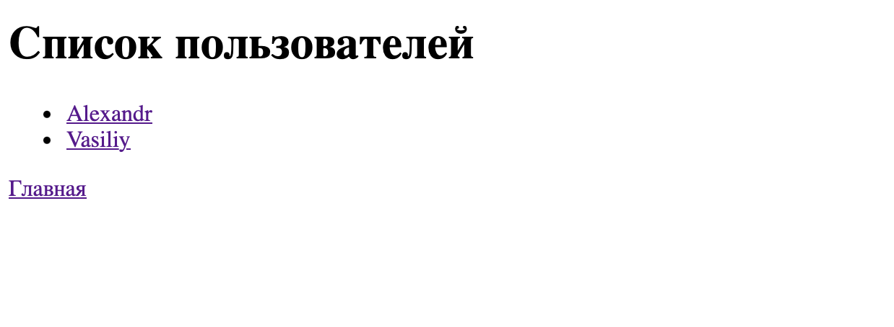
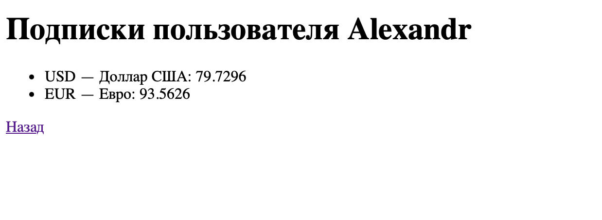
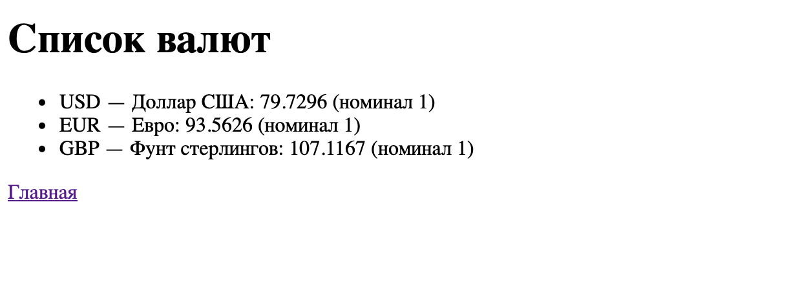
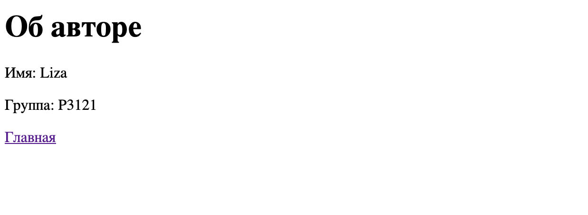
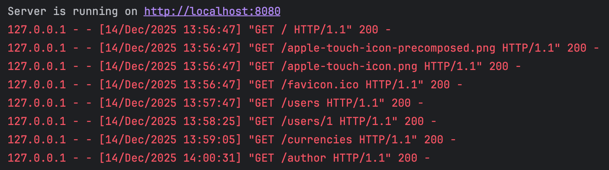
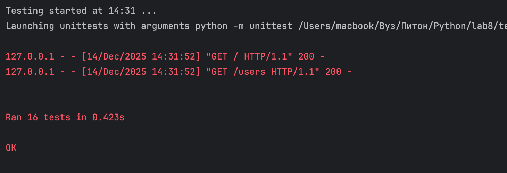

# Лабораторная работа №9

## Цели работы

- Создать простое клиент-серверное приложение на Python без использования серверных фреймворков.
- Освоить работу с HTTPServer и реализовать маршрутизацию HTTP-запросов.
- Применять шаблонизатор Jinja2 для отображения данных в HTML.
- Реализовать модели предметной области (User, Currency, UserCurrency, App, Author) с геттерами и сеттерами для проверки корректности данных.
- Структурировать код в соответствии с архитектурой MVC (модель–вид– контроллер).
- Получать актуальные данные о курсах валют через функцию get_currencies и
отображать их пользователям.
- Реализовать функциональность подписки пользователей на валюты и возможность отображения динамики их изменения.
- Научиться создавать тесты для моделей и серверной логики, проверяя корректность работы приложения.
2. Описание предметной обла

---

## Описание моделей, их свойств и связей

Приложение моделирует систему управления пользователями и их подписками на валюты.

### Модели

- **Author** — автор приложения  
  - name  
  - group

- **App** — приложение  
  - name  
  - version  
  - author — связь с объектом `Author`

- **User** — пользователь  
  - id 
  - name

- **Currency** — валюта  
  - id 
  - num_code 
  - char_code  
  - name  
  - value 
  - nominal

- **UserCurrency** — связь «многие ко многим» между пользователями и валютами  
  - id  
  - user_id 
  - currency_id

 Один пользователь может быть подписан на несколько валют.

---

## Структура проекта
lab8/
├── models/ # Модели

│   ├── __init__.py

│   ├── app.py # Модель приложения 

│   ├── author.py # Модель автора 

│   ├── currency.py # Модель валюты 

│   ├── user.py # Модель пользователя 

│   └── user_currency.py # Модель связи между User и Currency

├── my_env/ # Виртуальное окружение

├── static/ # Статические файлы (изображения)

├── templates/ # Шаблоны Jinja2 для рендеринга HTML

│   ├── author.html # Страница информации об авторе

│   ├── currencies.html # Страница со списком всех валют

│   ├── index.html # Главная страница

│   ├── user_subscriptions.html # Страница подписок пользователя

│   └── users.html # Страница со списком пользователей

├── tests/ # Тесты приложения

│   └── tests.py # Общие тесты

├── utils/ # Утилиты и вспомогательные функции

│   └── currencies_api.py # Функция get_currencies() — запрос к API ЦБ РФ

├── __init__.py

├── myapp.py # Основной запускаемый файл приложения

└── README.md # Отчет

## Реализация моделей

Каждая сущность (Author, User, Currency и др.) — отдельный класс в папке `models/`. Атрибуты хранятся приватно, доступ через геттеры и сеттеры. Сеттеры проверяют типы (например, `id` — целое, `name` — строка) и при нарушении вызывают `ValueError`. Это обеспечивает инкапсуляцию и защиту данных.

## Маршруты

Поддерживаются 5 маршрутов:

* главная;
* автор;
* список пользователей;
* профиль пользователя;
* курсы валют.

Для каждого формируется контекст и рендерится шаблон. 

## Jinja2

Шаблонизатор инициализируется один раз при старте: `Environment` с `FileSystemLoader("templates")`. При запросе шаблон подставляется с данными и отправляется как HTML.

## Курсы валют

Функция `get_currencies` (в `utils/currencies_api.py`) запрашивает XML от ЦБ РФ через `urllib`, парсит его, преобразует значение курса и создаёт объекты `Currency`. Ошибки сети или парсинга перехватываются.

На странице `/currencies` отображаются все валюты, а на `/user` — только подписанные (через связь `UserCurrency`).

## Скриншоты работы приложения







## Примеры тестов
Пример тест для модели
```python
class TestAuthorModel(unittest.TestCase):
    """Тестирование модели Author."""
    def test_getters_setters(self):
        """Проверка работы геттеров и сеттеров."""
        author = Author("Liza", "P3121")
        self.assertEqual(author.name, "Liza")
        self.assertEqual(author.group, "P3121")
        author.name = "Anna"
        self.assertEqual(author.name, "Anna")
        author.group = "P1234"
        self.assertEqual(author.group, "P1234")

    def test_invalid_values(self):
        """Проверка обработки некорректных значений."""
        with self.assertRaises(ValueError):
            Author("A", "P3121")
        with self.assertRaises(ValueError):
            Author("Liza", "P1")
```

Примеры тест контроллера
```python
class TestController(unittest.TestCase):
    """Тестирование HTTP-контроллера."""
    @classmethod
    def setUpClass(cls):
        """Запуск сервера в отдельном потоке для тестов."""
        cls.server = HTTPServer(('localhost', 8081), SimpleHTTPRequestHandler)
        cls.thread = threading.Thread(target=cls.server.serve_forever)
        cls.thread.daemon = True
        cls.thread.start()

    def get_path(self, path):
        """Функция для выполнения GET-запроса."""
        conn = http.client.HTTPConnection('localhost', 8081)
        conn.request("GET", path)
        response = conn.getresponse()
        data = response.read().decode()
        conn.close()
        return response.status, data

    def test_index(self):
        """Проверка главной страницы."""
        status, data = self.get_path("/")
        self.assertEqual(status, 200)
        self.assertIn("Приложение для отслеживания курсов валют", data)

```

Примеры теста функции get_curencies
```python
class TestGetCurrenciesFunction(unittest.TestCase):
    """Тестирование функции получения курсов валют."""

    def test_valid_currencies(self):
        """Проверка корректного получения существующих валют."""
        result = get_currencies(['USD', 'EUR'])
        self.assertIn('USD', result)
        self.assertIn('EUR', result)
        self.assertIsInstance(result['USD'], float)

    def test_nonexistent_currency(self):
        """Проверка обработки несуществующей валюты."""
        with self.assertRaises(KeyError):
            get_currencies(['XYZ'])
```


# Выводы
* Реализация MVC
Model (Модель)
Модель отвечает за хранение данных и бизнес-логику приложения.
Классы предметной области: User, Currency, App, Author, UserCurrency.
Они инкапсулируют данные и включают валидацию через геттеры и сеттеры (например, проверка длины имени автора или корректности кода валюты).
Утилита utils/currencies_api.py с функцией get_currencies(), которая получает актуальные курсы валют из внешнего API.

View (Представление)
Представление отвечает за отображение данных пользователю.
HTML-шаблоны в директории templates/ (index.html, users.html, currencies.html и др.).
Шаблонизатор Jinja2 подставляет данные (например, список пользователей или курсы валют) в шаблоны и генерирует финальный HTML.

Controller (Контроллер)

Обработчик HTTP-запросов в файле myapp.py:
Анализирует путь запроса (/, /users, /currencies и т.д.).
Вызывает необходимые функции модели.
Подготавливает данные и передаёт их в шаблон через Jinja2.

Такой подход упрощает поддержку и расширение приложения, так как каждая часть системы отвечает за свою зону ответственности.

* Новые навыки:
- Работа с HTTPServer: настройка маршрутов, корректная обработка GET-запросов и ошибок.
- Jinja2: использование шаблонов для динамической генерации HTML.

* Проблемы при реализации:
- При работе с HTTPServer нужно было учитывать корректную обработку разных типов запросов и ошибок.
- Использование Jinja2 потребовало внимательного управления шаблонами, чтобы динамически формировать страницы без дублирования кода.

