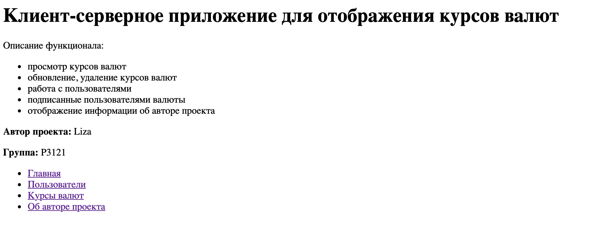
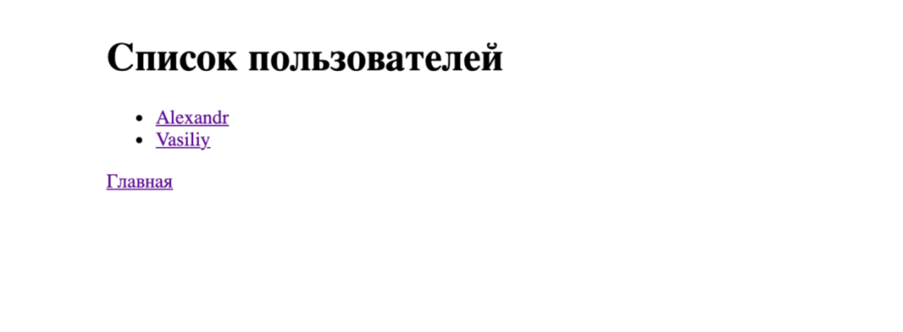
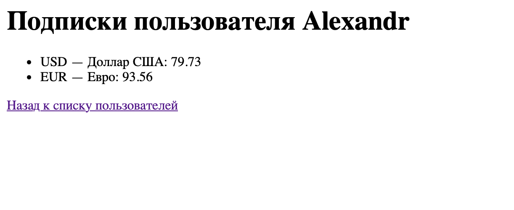
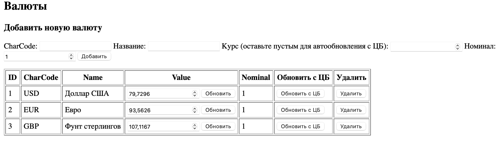
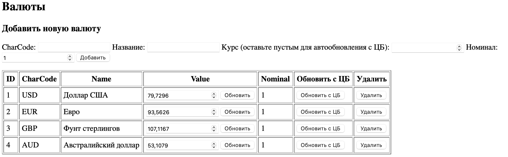
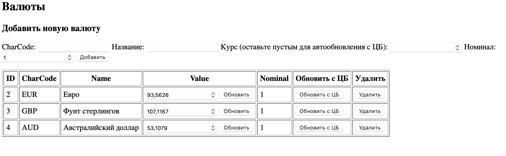
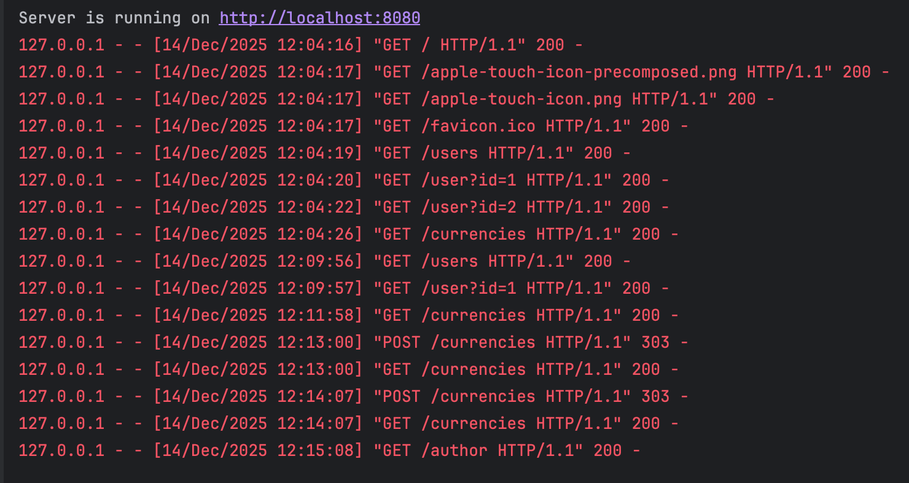
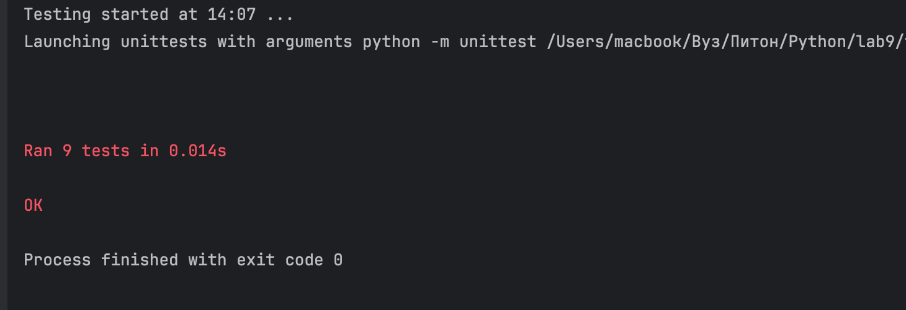
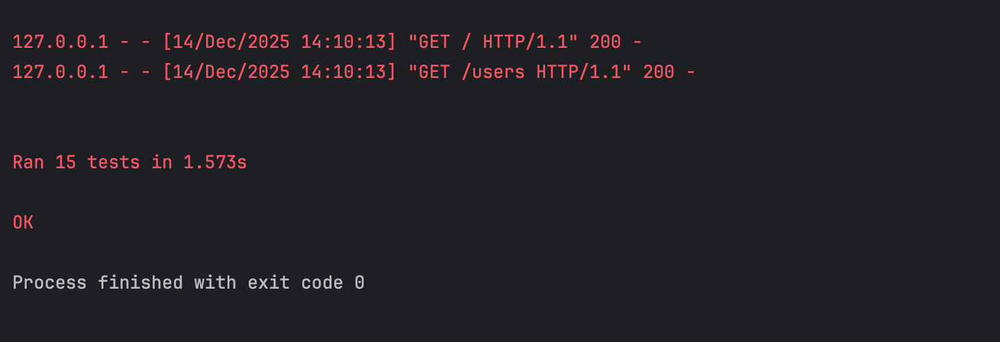

# Лабораторная работа №9

## Цели работы

1. Реализовать CRUD (Create, Read, Update, Delete) для сущностей бизнес-логики приложения.  
2. Освоить работу с SQLite в памяти (`:memory:`) через модуль `sqlite3`.  
3. Понять принципы первичных и внешних ключей и их роль в связях между таблицами.  
4. Выделить контроллеры для работы с БД и для рендеринга страниц в отдельные модули.  
5. Использовать архитектуру MVC и соблюдать разделение ответственности.  
6. Отображать пользователям таблицу с валютами, на которые они подписаны.  
7. Реализовать полноценный роутер, который обрабатывает GET-запросы и выполняет сохранение/обновление данных и рендеринг страниц.  
8. Научиться тестировать функционал на примере сущностей `currency` и `user` с использованием `unittest.mock`.

---

## Описание моделей, их свойств и связей

Приложение моделирует систему управления пользователями и их подписками на валюты.

### Модели

- **Author** — автор приложения  
  - name  
  - group

- **App** — приложение  
  - name  
  - version  
  - author — связь с объектом `Author`

- **User** — пользователь  
  - id 
  - name

- **Currency** — валюта  
  - id 
  - num_code 
  - char_code  
  - name  
  - value 
  - nominal

- **UserCurrency** — связь «многие ко многим» между пользователями и валютами  
  - id  
  - user_id 
  - currency_id

 Один пользователь может быть подписан на несколько валют.

---

## Структура проекта
lab9/
├── controllers/ # Контроллеры
│   ├── __init__.py # Инициализация
│   ├── currencycontroller.py # Контроллер для работы с валютами
│   └── databasecontroller.py # Инфраструктурный контроллер для работы с SQLite
├── models/ # Модели
│   ├── __init__.py
│   ├── app.py # Модель приложения 
│   ├── author.py # Модель автора 
│   ├── currency.py # Модель валюты 
│   ├── user.py # Модель пользователя 
│   └── user_currency.py # Модель связи между User и Currency
├── my_env/ # Виртуальное окружение 
│   ├── bin/
│   ├── include/
│   ├── lib/
│   ├── .gitignore
│   ├── __init__.py
│   └── pyvenv.cfg
├── static/ # Статические файлы (изображения)
├── templates/ # Шаблоны Jinja2 для рендеринга HTML
│   ├── author.html # Страница информации об авторе
│   ├── currencies.html # Страница со списком всех валют
│   ├── index.html # Главная страница
│   ├── user_subscriptions.html # Страница подписок пользователя
│   └── users.html # Страница со списком пользователей
├── tests/ # Тесты приложения
│   ├── test_crud.py # Тесты CRUD-операций
│   └── tests.py # Общие тесты
├── utils/ # Утилиты и вспомогательные функции
│   └── currencies_api.py # Функция get_currencies() — запрос к API ЦБ РФ
├── __init__.py
├── myapp.py # Основной запускаемый файл приложения
└── README.md # Отчет

## Реализация моделей

Каждая сущность (Author, User, Currency и др.) — отдельный класс в папке `models/`. Атрибуты хранятся приватно, доступ через геттеры и сеттеры. Сеттеры проверяют типы (например, `id` — целое, `name` — строка) и при нарушении вызывают `ValueError`. Это обеспечивает инкапсуляцию и защиту данных.

## Маршруты

Поддерживаются 5 маршрутов:

* главная;
* автор;
* список пользователей;
* профиль пользователя;
* курсы валют.

Для каждого формируется контекст и рендерится шаблон. 

## Jinja2

Шаблонизатор инициализируется один раз при старте: `Environment` с `FileSystemLoader("templates")`. При запросе шаблон подставляется с данными и отправляется как HTML.

## Курсы валют

Функция `get_currencies` (в `utils/currencies_api.py`) запрашивает XML от ЦБ РФ через `urllib`, парсит его, преобразует значение курса и создаёт объекты `Currency`. Ошибки сети или парсинга перехватываются.

На странице `/currencies` отображаются все валюты, а на `/user` — только подписанные (через связь `UserCurrency`).

## Реализация CRUD

### 1. Создание валюты (Create)

Метод:
```python
currency_create(num_code, char_code, name, value=None, nominal=1)
```
Добавляет новую валюту в таблицу `currency`. Если `value` не указан, берётся текущий курс с API ЦБ.

### 2. Чтение всех валют (Read)

Метод:
```python
currency_read_all()
```
Возвращает список всех валют из таблицы `currency`.

### 3. Обновление курса валюты (Update)

Метод:
```python
currency_update(char_code, new_value=None)
```
Обновляет значение `value` валюты с заданным `char_code`. Если `new_value=None`, берётся актуальный курс с API ЦБ.

### 4. Удаление валюты (Delete)

Метод:
```python
currency_delete(currency_id)
```
Удаляет валюту по `id` из таблицы `currency`.

## Скриншоты работы приложения




* Результат добавления валюты

* Результат удаления валюты



## Примеры тестов
Пример тест для модели
```python
class TestAuthorModel(unittest.TestCase):
    """Тестирование модели Author."""
    def test_getters_setters(self):
        """Проверка работы геттеров и сеттеров."""
        author = Author("Liza", "P3121")
        self.assertEqual(author.name, "Liza")
        self.assertEqual(author.group, "P3121")
        author.name = "Anna"
        self.assertEqual(author.name, "Anna")
        author.group = "P1234"
        self.assertEqual(author.group, "P1234")

    def test_invalid_values(self):
        """Проверка обработки некорректных значений."""
        with self.assertRaises(ValueError):
            Author("A", "P3121")
        with self.assertRaises(ValueError):
            Author("Liza", "P1")
```

Примеры тест контроллера
```python
class TestController(unittest.TestCase):
    """Тестирование HTTP-контроллера."""
    @classmethod
    def setUpClass(cls):
        """Запуск сервера в отдельном потоке для тестов."""
        cls.server = HTTPServer(('localhost', 8081), SimpleHTTPRequestHandler)
        cls.thread = threading.Thread(target=cls.server.serve_forever)
        cls.thread.daemon = True
        cls.thread.start()

    def get_path(self, path):
        """Функция для выполнения GET-запроса."""
        conn = http.client.HTTPConnection('localhost', 8081)
        conn.request("GET", path)
        response = conn.getresponse()
        data = response.read().decode()
        conn.close()
        return response.status, data

    def test_index(self):
        """Проверка главной страницы."""
        status, data = self.get_path("/")
        self.assertEqual(status, 200)
        self.assertIn("Приложение для отслеживания курсов валют", data)

```

Примеры теста функции get_curencies
```python
class TestGetCurrenciesFunction(unittest.TestCase):
    """Тестирование функции получения курсов валют."""

    def test_valid_currencies(self):
        """Проверка корректного получения существующих валют."""
        result = get_currencies(['USD', 'EUR'])
        self.assertIn('USD', result)
        self.assertIn('EUR', result)
        self.assertIsInstance(result['USD'], float)

    def test_nonexistent_currency(self):
        """Проверка обработки несуществующей валюты."""
        with self.assertRaises(KeyError):
            get_currencies(['XYZ'])
```


Примеры теста CRUD
```python
class TestCurrencyController(unittest.TestCase):
    def setUp(self):
        self.mock_db = MagicMock(spec=DatabaseController)
        self.controller = CurrencyController(self.mock_db)

    def test_update_currency(self):
        """Проверка обновления курса валюты."""
        self.controller.update_currency("EUR", 95.0)
        self.mock_db.currency_update.assert_called_once_with("EUR", 95.0)

    def test_update_negative_value(self):
        """Обновление валюты с отрицательным значением (контроллер просто передаёт в БД)."""
        self.controller.update_currency("GBP", -10.0)
        self.mock_db.currency_update.assert_called_once_with("GBP", -10.0)
```
Все тесты приложение проходит.




## Выводы
* Реализация MVC
Model (Модель)

— Это доменные объекты, описанные в папке models/: Author, User, Currency, UserCurrency.
— Они инкапсулируют данные и бизнес-правила(все атрибуты приватные, геттеры/сеттеры с валидацией типов, выбрасывают ValueError при некорректных данных)

View (Представление)

— Шаблоны в папке templates/, обрабатываемые Jinja2.
— Получают контекст в виде словарей или объектов от контроллеров.
— Отвечают только за отображение — без логики и прямого доступа к данным.

Controller (Контроллер)

1. CurrencyController 

— Работает с доменными сущностями
— Не взаимодействует напрямую с данными — делегирует операции DatabaseController.

2. DatabaseController — инфраструктурный контроллер

— Отвечает за доступ к данным: подключение к SQLite, выполнение SQL-запросов.
— Реализует CRUD-операции в терминах SQL и словарей (dict(row)).
— Интегрируется с внешним API (get_currencies).

Такой подход упрощает поддержку и расширение приложения, так как каждая часть системы отвечает за свою зону ответственности.

* SQLite обеспечивает надежное хранение данных без необходимости настройки отдельного сервера БД, что удобно для небольших локальных приложений.
* Применение шаблонов упрощает поддержку сложных интерфейсов с динамическими таблицами, формами и навигацией.
* Использование `unittest` и `mock` облегчает тестирование контроллеров без зависимости от реальной базы данных и внешних API.


