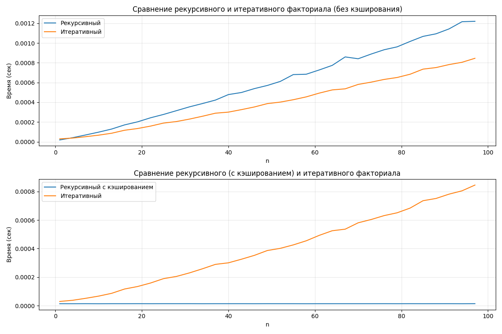

# Отчет: Сравнение производительности алгоритмов вычисления факториала
В данном отчете представлены результаты сравнительного анализа производительности различных алгоритмов вычисления факториала. Тестирование проводилось для значений n от 1 до 100 с шагом 3.
Были протестированы три подхода:
- Рекурсивный алгоритм без кэширования
- Рекурсивный алгоритм с использованием LRU-кэша
- Итеративный алгоритм 

## Результаты представлены на графиках

### Анализ производительности
Без кэширования
- Итеративный алгоритм показал наилучшую производительность (время выполнения растет линейно с увеличением n)
- Рекурсивный алгоритм значительно медленнее из-за накладных расходов на вызовы функций

С использованием кэширования
- Рекурсивный алгоритм с кэшированием показал наилучшую производительность
- Кэширование устраняет повторные вычисления

## Выводы
1. Для единичных вычислений итеративный алгоритм является оптимальным выбором
2. Для множественных вычислений (при больших n) рекурсивный алгоритм с кэшированием является оптимальным выбором

