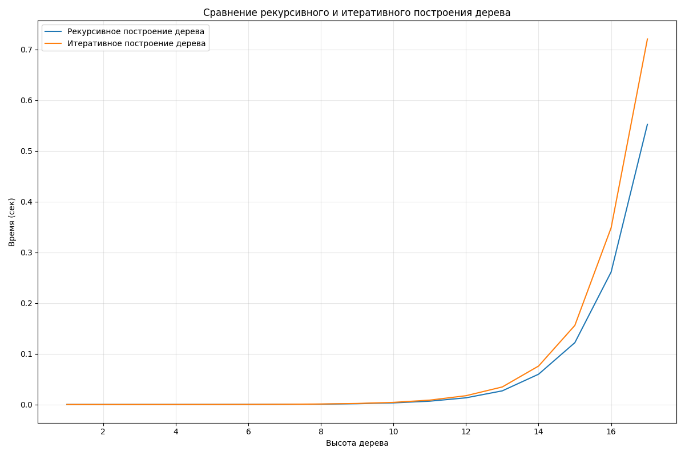

# Отчет: Сравнение производительности алгоритмов построения дерева
В данном отчете представлены результаты сравнительного анализа производительности двух алгоритмов построения дерева. Тестирование проводилось для высот дерева от 1 до 17.
Были протестированы два подхода:
- Рекурсивный алгоритм
- Итеративный алгоритм

## Результаты представлены на графиках

### Анализ производительности
Рекурсивный алгоритм
- При высоте 16 время выполнения примерно 0.6 секунд
- Характер роста указывает на экспоненциальную сложность алгоритма

Итеративный алгоритм
- При высоте 16 время выполнения составляет около 0.1 секунд
- Значительно более эффективен при больших высотах дерева

## Выводы
1. Для малых высот дерева (до 8-10 уровней) разница в производительности между алгоритмами незначительна
2. Для средних и больших высот итеративный алгоритм более эффективен
